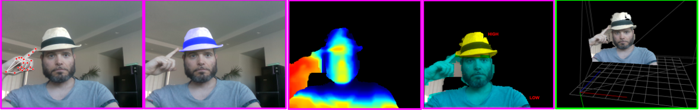
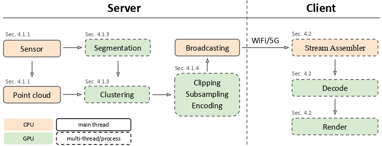

# HOPE

HOPE is a real-time point-cloud streaming system for XR/telepresence. The producer side captures point clouds, compresses them with CUDA, and streams them to a browser client that decodes and renders them in WebGL/WebXR.

## What HOPE does 
- Captures RGB-D data (RealSense) and creates point-cloud frames.
- Splits points into importance clusters (HIGH/MED/LOW) using SAM2 or YOLO segmentation.
- Quantizes and compresses each cluster on the GPU using CUDA.
- Broadcasts them over WebSockets (`wss://<host>:9003`).
- Browser client receives chunks, decodes them on the GPU using CUDA, and renders in 3D/VR.


<p>
  <br>
  <em>Figure 1: HOPE pipeline visualization. Pink borders highlight server-side stages, while green refers to client-side stages</em>
</p>

<p>
  <br>
  <em>Figure 2: HOPE pipeline diagram.</em>
</p>

## Server
The producer entrypoint is `producer/producer.py`.

1. Builds web client bundle (`npm run build` in `Client/`).
2. Generates  TLS certificate in `producer/cert/`.
3. Start:
   - WSS point-cloud server on port `9003`.
   - HTTPS static web server on port `9004` (serves `Client/dist`).
4. Start camera pipeline (`hope_server.launch_processes(...)`):
   - Reads color + depth frames provided by the Realsense camera.
   - Runs predictor (`sam2` or `yolo`) for clustering.
   - Builds HIGH/MED/LOW importance clusters.
   - Allocates per-cluster budgets.
   - Encode each cluster with CUDA quantization.
   - Broadcast chunk packets with a 6-byte header.

## Client 
The Client entrypoint is `Client/src/main_ws.ts`.

1. Opens WSS connection to `wss://<server-host>:9003`.
2. For each message:
   - Parses the 6-byte server header.
   - Copies payload into a shared double buffer.
   - Decodes/uploads chunk to GPU point-cloud renderer.
3. Renders continuously in Three.js.

## Prerequisites
### Software
- Python >=3.10, <3.12
- Node.js 18+
- NVIDIA CUDA-capable GPU
### Hardware
- Intel Realsense Depth Camera 435i, or any other realsense camera that supports the following resolutions:
  - For RGB:
     - `1280 x 720`
     - `848 x 480`
     - `640 x 360`
  - For Depth:
     - `1280 x 720`
     - `848 x 480`
     - `640 x 360`

### Libraries used
#### Server
| Library | Version |
| --- | --- |
| ultralytics | `8.3.169` |
| torch | `2.7.1+cu128` |
| torchvision | `0.22.1+cu128` |
| torchaudio | `2.7.1+cu128` |
| requests | `2.32.4` |
| opencv-python | `4.12.0.88` |
| numpy | `2.2.6` |
| pyrealsense2 | `2.55.1.6486` |
| mediapipe | `0.10.14` |
| tqdm | `4.67.1` |
| omegaconf | `2.3.0` |
| hydra-core | `1.3.2` |
| cupy-cuda12x | `13.4.1` |


#### Client
| Library | Version |
| --- | --- |
| three | `^0.176.0` |
| js-yaml | `^4.1.1` |
| typescript | `~5.7.2` |
| vite | `^6.3.1` |
| @types/three | `^0.176.0` |
| @types/js-yaml | `^4.0.9` |
| @vitejs/plugin-basic-ssl | `^2.0.0` |


## Install
### Server
```bash
git clone https://github.com/phasmatic3d/hope.git
cd hope
pip install -r requirements.txt
```

#### SAM2 Installation:
Under `producer\`, run:
```bash

git clone https://github.com/facebookresearch/sam2.git
cd sam2
pip install -e .
python setup.py build
python setup.py install
```

### Client
If you do not already have the client dependencies installed, run `npm install` in `Client/`.


## TLS Certificate (for HTTPS and WSS)
- At startup, the producer generates:
  - `producer/cert/server.crt`
  - `producer/cert/server.key`
- These are required to broadcast over HTTPS with WSS.

How to use `server.crt`:
1. Export/copy `producer/cert/server.crt` to the client machine.
2. Import it into your OS/browser trusted certificates (typically, open the file and click on "Install Certificate").
3. Restart browser if open.
4. Open `https://<server-ip>:9004` while the server is running on the server machine.


### Run (From `producer/` directory)
- To create the clusters using SAM2:
```bash
python producer.py --cluster_predictor sam2
```
- To create the clusters using YOLO11e:
```bash
python producer.py --cluster_predictor yolo
```
Then open:
- `https://<server-ip>:9004` on the browser of your choice to open the client. This can be done on any device with a trusted TLS certificate that is connected to the same network as the server machine.


## Offline pipeline (for metrics and reproducability)
Offline mode reads `.ply` frames from:
- `producer/exported_PCs/<OFFLINE_PREFIX>/`

It writes outputs to:
- `producer/exported_PCs/<OFFLINE_PREFIX>_IMPORTANCE/`
  - Reconstructed compressed `.ply` files
  - A `compression_report.csv` with metrics for every .ply processing
  
Use the offline pipeline for exporting metrics for .ply video streams.


## CLI usage
CLI options are defined in `producer/producer_cli.py` and are consumed by `producer/producer.py`.

### Common options:
- `--cluster_predictor {sam2,yolo}`: segmenter.
- `--point_cloud_budget <int>`: max points per frame budget (less budget will result in more aggressive subsampling of the clusters).
- `--enable_depth_clip`: clip depth range before encoding.
- `--offline_mode`: run offline compression/streaming instead of camera mode.

### Exclusive to offline mode:
- `--offline_prefix <name>`: dataset folder under `producer/exported_PCs/<name>`.
- `--offline_bandwidth_mb_per_s <float>`: bandwidth target for budget derivation.
- `--offline_query_x`, `--offline_query_y`: SAM2 prompt point.

#### Examples:
```bash
python producer.py --cluster_predictor sam2
python producer.py --cluster_predictor yolo --point_cloud_budget 120000
python producer.py --cluster_predictor sam2 --enable_depth_clip
```

## Reproducing experiment results
Our dataset can be downloaded at `https://drive.google.com/file/d/1RqNINdILSmxQMbUaw2XDLmKt4yR2F0cy/view?usp=sharing`. It contains:
- The original .ply video stream.
- The uniformaly (naïvely) subsampled .ply video stream (UNIFORM suffix).
- The .ply video stream subsampled with our importance-based scheme (IMPORTANCE suffix).

To reproduce the results:
1. Copy the three original video stream folders (GAME, TRACKING, WIIMOTE) into `producer/exported_PCs`.
2. Run the following commands, one at a time:

### WIIMOTE
```bash
python producer.py --cluster_predictor sam2 --offline_mode --offline_prefix "WIIMOTE" --offline_query_x 420 --offline_query_y 210 --offline_bandwidth_mb_per_s 9.5
```

### GAME
```bash
python producer.py --cluster_predictor sam2 --offline_mode --offline_prefix "GAME" --offline_query_x 300 --offline_query_y 350 --enable_depth_clip --offline_bandwidth_mb_per_s 11
```

### TRACKING
```bash
python producer.py --cluster_predictor yolo --offline_prefix "TRACKING" --offline_mode
```

3. For every dataset that has finished being streamed to the client, client-side metrics can be exported by pressing the "Download Perf CSV" button on the top-right corner of the Three.js window.
   
**Note:** the color + depth frame capture times in the three original .ply video stream folders have been produced using a Realsense D435i camera on an Intel i3-8100 processor. These provide a conservative baseline for the point-cloud capture times and can be substituted with the user's custom capture time results, using any recording software.

## License
`[TODO: EXPLAIN LICENSE]`

## Citing HOPE
If you use HOPE in your research projects or application, please use the following BibTex entries:

### Main paper
`[TODO: PUT PAPER CITATION HERE]`

### Hope Repo
`[TODO: PUT REPO CITATION HERE]`

